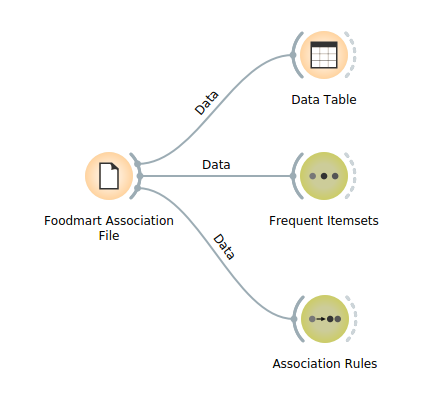
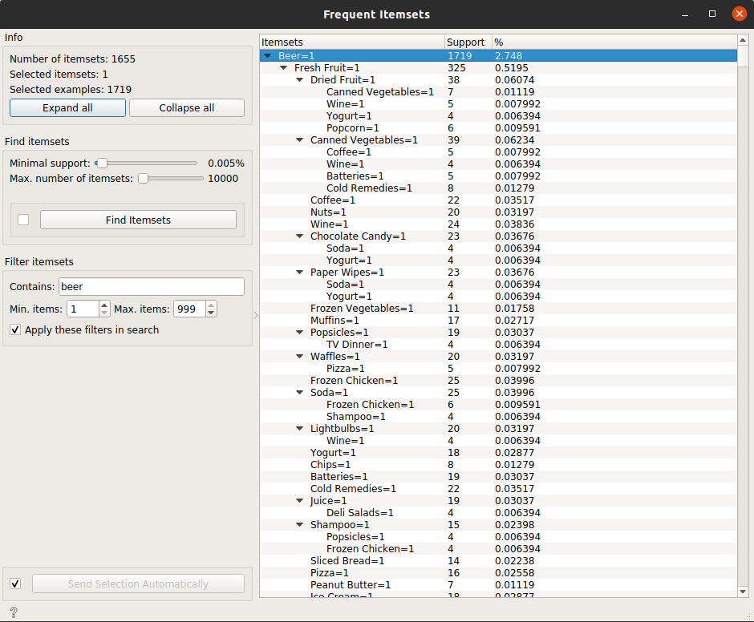
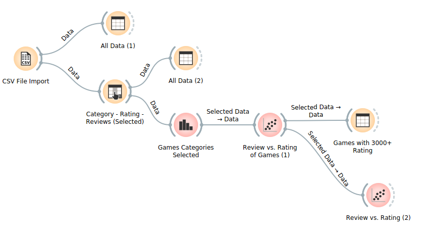
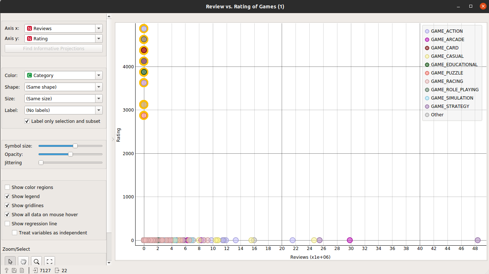
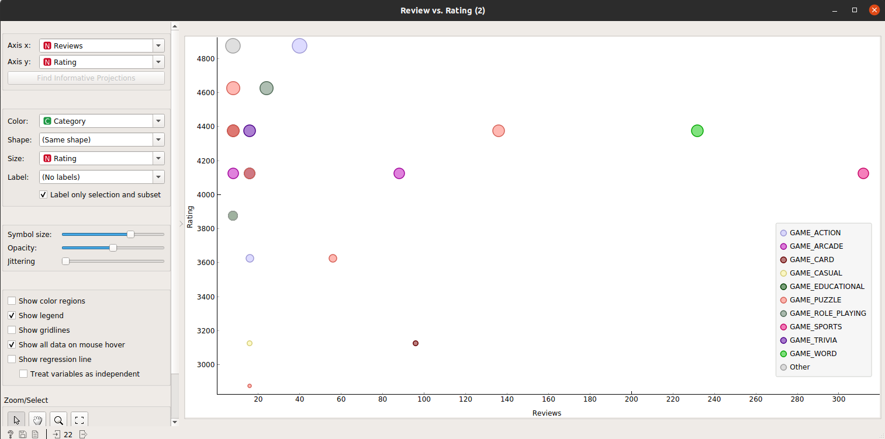
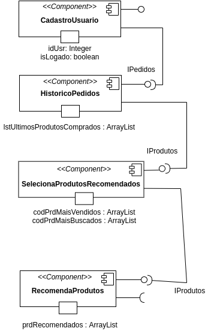
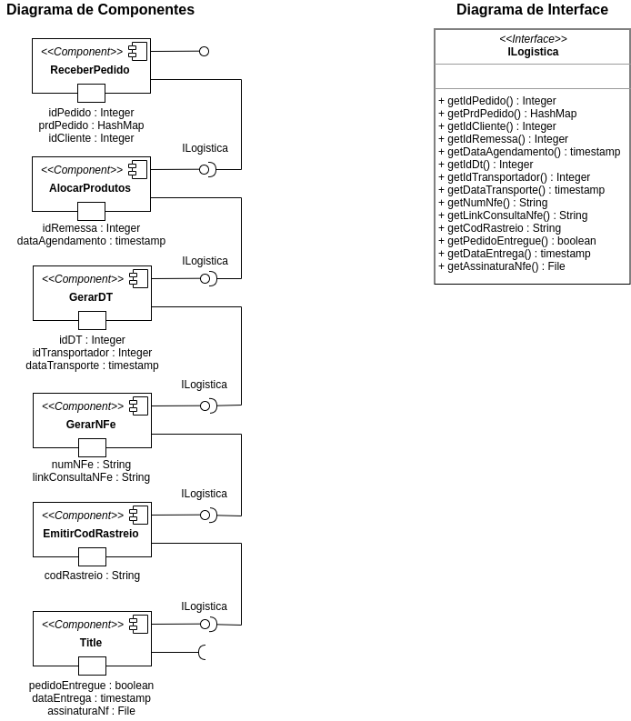

# LAB_01 - Data Flow

> Informações sobre as atividades exigidas no laboratório neste [LINK](https://github.com/santanche/component2learn/tree/master/labs/01-data-flow).

## :arrow_forward: Aluno
* Rafael Mardegan Marquini

## :hammer: Ferramentas e Tecnologias
* [Ubuntu-20.04](https://ubuntu.com/)
* [Anaconda](https://www.anaconda.com/)
* [Orange3](https://orange.biolab.si/)
* [Draw.io](https://www.draw.io/)

## :small_orange_diamond: Orange

### --- Tarefa Foodmart --- 

### Imagem do Projeto

 

### Arquivo do Projeto
[Arquivo do Projeto Orange](foodmart-analysis.ows)

### Regras de Associação
Para utilizar as definições de associções automáticas utilizei no filtro dos dados o parâmetro `beer` com taxa mínima de confiânça em 50%. As telas a seguir mostram os resultados obtidos:
 

 

 

### --- Tarefa Google Playstore ---

### Imagem do Projeto

 

### Arquivo do Projeto
[Arquivo do Projeto Orange](google-playstore-analysis.ows)

### Gráficos gerados nas análises
 

 

## :pencil2: Projeto de Composição

### --- Tarefa Projeto de Composição para Recomendação ---

### --- Tarefa Projeto de Composição de Pedido ---

---
Made with :coffee: by Rafa Mardegan.

