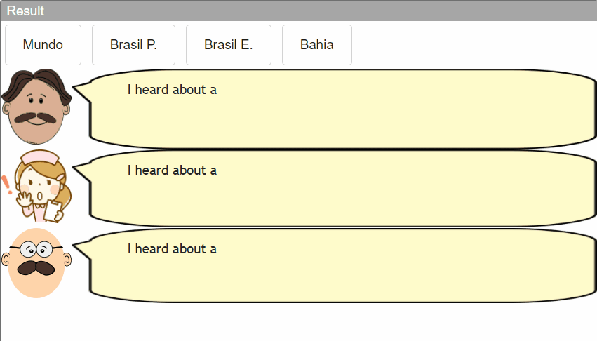

# LAB_02 - Data Flow e Componentes

> Informações sobre as atividades exigidas no laboratório neste [LINK](https://github.com/santanche/component2learn/tree/master/labs/02-data-flow_messages).

## :arrow_forward: Aluno
* Rafael Mardegan Marquini

## :hammer: Ferramentas e Tecnologias
* [Jupyter Notebook](https://jupyter.org/)
* [Java 8](https://developers.redhat.com/products/openjdk/download)

## :pencil: Tarefas

### :heavy_check_mark: Data Flow e Componentes (parte 2)

A entrega desta atividade compreende na resolução de 6 exercícios apresentados no notebook a seguir:
[components-01-catalog.ipynb](https://github.com/rmmarquini/engsoft-inf331-labs/blob/master/lab2/notebook/data-flow/s02catalog/components-01-catalog.ipynb); que apresenta o catálogo de componentes, o modo de conectá-los (visto pela perspectiva blackbox - externa) para montar uma composição.

> Instância do Binder com o notebook contendo os exercícios resolvidos

[](https://mybinder.org/v2/gh/rmmarquini/engsoft-inf331-labs/master)

### :construction: Componentes e Mensagens

Esse lab é voltado à componentes na Web usando a implementação do Digital Content Component (DCC). Utilizei o ambiente [DCC Playground](https://santanche.github.io/component2learn/labs/02-data-flow_messages/notebooks/messages/dccs/playground/) para concluir as atividades abaixo.

#### Tarefa Web Components 1

```
<dcc-trigger label="Mundo"
             action="noticia/mundo/politica"
             value="Nova notícia mundo política">
</dcc-trigger>

<dcc-trigger label="Brasil P."
             action="noticia/brasil/politica"
             value="Nova notícia Brasil política">
</dcc-trigger>

<dcc-trigger label="Brasil E."
             action="noticia/brasil/esporte"
             value="Nova notícia Brasil esporte">
</dcc-trigger>

<dcc-trigger label="Bahia"
             action="noticia/bahia/esporte"
             value="Nova notícia Bahia esporte">
</dcc-trigger>

<dcc-lively-talk duration="0s"
                 character="doctor"
                 speech="I heard about a ">
  <subscribe-dcc topic="noticia/#/politica"></subscribe-dcc>
</dcc-lively-talk>

<dcc-lively-talk duration="0s"
                 character="nurse"
                 speech="I heard about a ">
  <subscribe-dcc topic="noticia/brasil/#"></subscribe-dcc>
</dcc-lively-talk>

<dcc-lively-talk duration="0s"
                 character="patient"
                 speech="I heard about a ">
  <subscribe-dcc topic="noticia/#/#"></subscribe-dcc>
</dcc-lively-talk>
```



#### Tarefa Web Components 2

```
<dcc-trigger label="Next Item" action="next/rss">
</dcc-trigger>

<dcc-rss publish="rss/science" source="https://www.wired.com/category/science/feed">
  <subscribe-dcc topic="next/rss" role="step"></subscribe-dcc>
</dcc-rss>

<dcc-aggregator publish="aggregate/science" quantity="3">
  <subscribe-dcc topic="rss/science"></subscribe-dcc>
</dcc-aggregator>

<dcc-rss publish="rss/design" source="https://www.wired.com/category/design/feed">
  <subscribe-dcc topic="next/rss" role="step"></subscribe-dcc>
</dcc-rss>

<dcc-lively-talk id="nurse"
                 duration="0s"
                 character="nurse"
                 speech="News ">
  <subscribe-dcc topic="rss/science"></subscribe-dcc>
</dcc-lively-talk>

<dcc-lively-talk id="nurse"
                 duration="0s"
                 character="doctor"
                 speech="News ">
  <subscribe-dcc topic="aggregate/science"></subscribe-dcc>
</dcc-lively-talk>

<dcc-lively-talk id="patient"
                 duration="0s"
                 character="patient"
                 speech="News ">
  <subscribe-dcc topic="rss/design"></subscribe-dcc>
</dcc-lively-talk>
```


---
Made with :coffee: by Rafa Mardegan.
