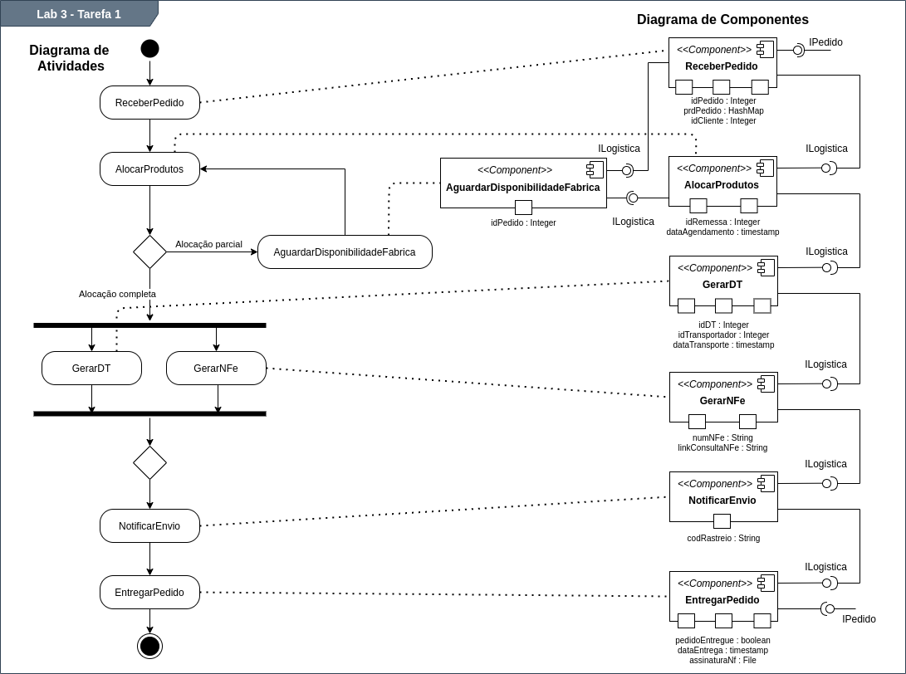

# LAB_03 - Orquestração e Coreografia

> Informações sobre as atividades exigidas no laboratório neste [LINK](https://github.com/santanche/component2learn/tree/master/labs/03-mvc).

## :arrow_forward: Aluno
* Rafael Mardegan Marquini

## :hammer: Ferramentas e Tecnologias
* [UML](https://www.uml.org/)
* [Drawio](https://app.diagrams.net/)

## :pencil: Tarefas

### :heavy_check_mark: Tarefa 1
> Representar o diagrama de composição criado no [Laboratório 1](https://github.com/rmmarquini/engsoft-inf331-labs/blob/master/lab1/img/diagram-2.png) em um diagrama de atividades.

### :heavy_check_mark: Tarefa 2

### :heavy_check_mark: Tarefa 3

---
Made with :coffee: by Rafa Mardegan.
