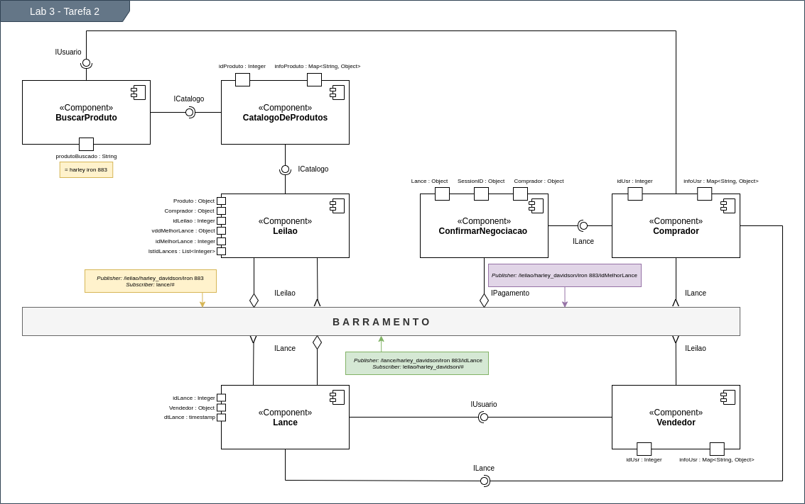
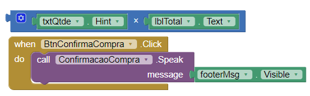

# LAB_03 - Orquestração e Coreografia

> Informações sobre as atividades exigidas no laboratório neste [LINK](https://github.com/santanche/component2learn/tree/master/labs/03-mvc).

## :arrow_forward: Aluno
* Rafael Mardegan Marquini

## :hammer: Ferramentas e Tecnologias
* [UML](https://www.uml.org/)
* [Drawio](https://app.diagrams.net/)
* [Android Studio AVD](https://developer.android.com/studio/run/managing-avds?hl=pt-br)
* [MIT App Inventor](https://appinventor.mit.edu/)

## :pencil: Tarefas

### :heavy_check_mark: Tarefa 1
> Representar o diagrama de composição criado no [Laboratório 1](https://github.com/rmmarquini/engsoft-inf331-labs/blob/master/lab1/img/diagram-2.png) em um diagrama de atividades.

### :heavy_check_mark: Tarefa 2
> Usando a representação de componentes que se comunicam por mensagens na forma de uma orquestração, elabore um diagrama contendo os componentes (Blackbox) e as respectivas interfaces de eventos para realizar um leilão virtual invertido de produtos, conforme a seguinte sequência:  &nbsp;&nbsp;&nbsp;&nbsp;1. O cliente seleciona o produto;  &nbsp;&nbsp;&nbsp;&nbsp;2. Um módulo de leilão informa a todos os potenciais fornecedores daquele produto sobre a demanda e inicia um leilão;  &nbsp;&nbsp;&nbsp;&nbsp;3. Os potenciais fornecedores fazem ofertas;  &nbsp;&nbsp;&nbsp;&nbsp;4. Os três produtos com menor preço são apresentados para o cliente - em caso de empate de preço, considerar quem fez primeiro a oferta.

### :heavy_check_mark: Tarefa 3
> Elabore um protótipo de uma interface gráfica com um usuário no MIT App Inventor que simule uma interface de compra. 

[Projeto .aia para ser restaurado no MIT App Inventor](tarefa3.aia)

#### Resultados

* Tela 1: Nenhum produto selecionado

* Tela 2: Primeiro produto selecionado

* Tela 3: segundo produto selecionado

* Tela 4: Compra de um dos produtos efetiva

 

* Tela 5: Diagrama de blocos

---
Made with :coffee: by Rafa Mardegan.
