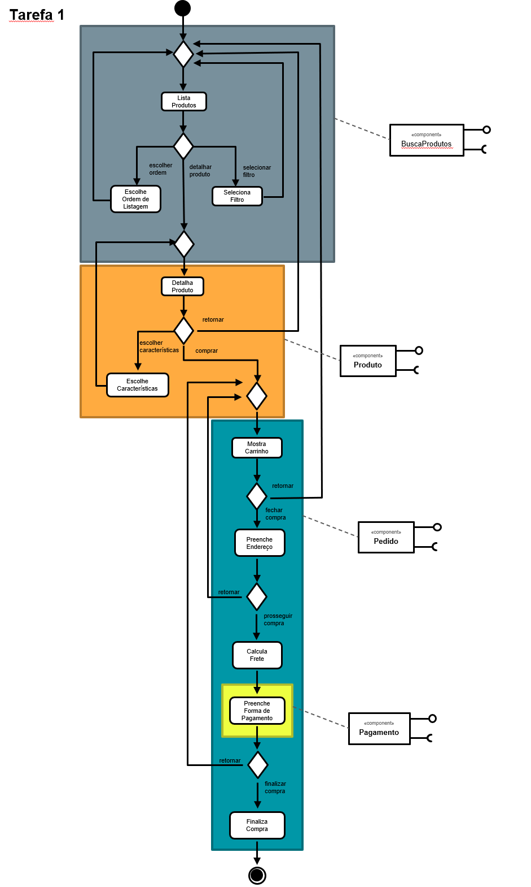
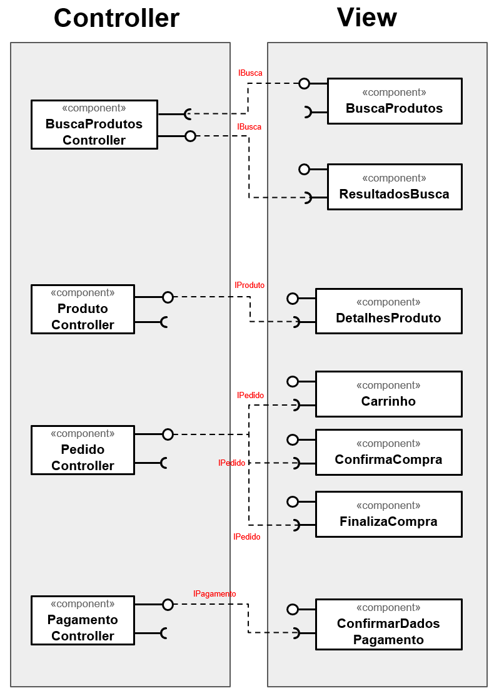
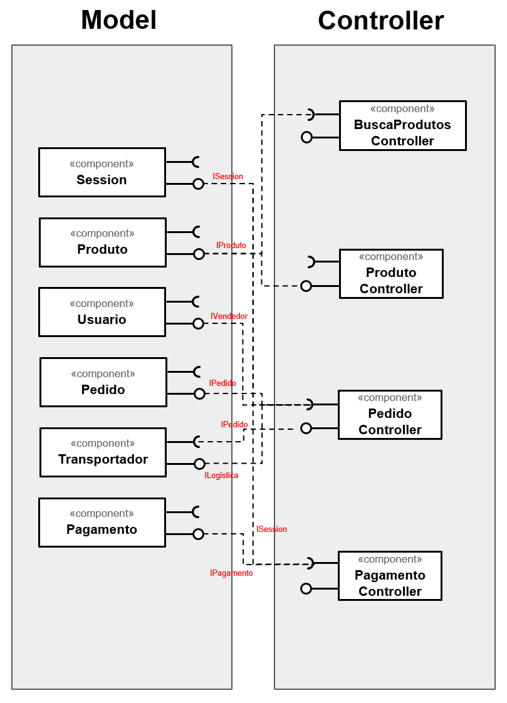

# LAB_04 - Serviços

> Informações sobre as atividades exigidas no laboratório neste [LINK](https://github.com/santanche/component2learn/tree/master/labs/04-servicos).

## :arrow_forward: Aluno
* Rafael Mardegan Marquini

## :hammer: Conceitos, Ferramentas e Tecnologias
* Componentização
* Design Pattern: MVC
* [UML](https://www.uml.org/)
* RESTful API
* JSON
* [Insomnia](https://insomnia.rest/)

## :pencil: Tarefas

### :heavy_check_mark: Tarefa 1: Componentes de Negócio
> Delimitar partes do diagrama que deveriam estar dentro de um componente.

### :heavy_check_mark: Tarefa 2: Componentes Técnicos
> Separar os componentes de View daqueles definidos no Controller

### :heavy_check_mark: Tarefa 3: Componentes Técnicos
>  Separar os componentes do Model daqueles definidos no Controller

### :heavy_check_mark: Tarefa 4
>  Encontre dois serviços REST interessantes, que recebam no mínimo dois parâmetros e execute pelo menos uma consulta em cada um deles. Apresente para cada serviço que você escolheu:

#### Serviço 1: 

* **Título:** Dólar comercial (venda e compra) - cotações diárias
* **URI:**

~~~
https://olinda.bcb.gov.br/olinda/servico/PTAX/versao/v1/odata/CotacaoMoedaDia(moeda=@moeda,dataCotacao=@dataCotacao)?@moeda=%27USD%27&@dataCotacao=%2708-28-2020%27&$top=1&$orderby=dataHoraCotacao%20desc&$format=json&$select=cotacaoCompra,cotacaoVenda,dataHoraCotacao
~~~

* **Descrição:** Endpoint do Banco Central do Brasil para consulta de cotação do dólar na data informada (padrão MM-dd-yyyy), coletando o registro "top=1" e ordenado pela data e hora da última cotação de forma descendente. Na URI, é informado o tipo do formato JSON e solicito a seleção apenas dos atributos que me interessam: "cotacaoCompra", "contacaoVenda", "dataHoraCotacao".
* **Cabeçalho HTTP da requisição:**

~~~http
GET /olinda/servico/PTAX/versao/v1/odata/CotacaoMoedaDia(moeda=@moeda,dataCotacao=@dataCotacao)?@moeda=%27USD%27&@dataCotacao=%2708-28-2020%27&$top=1&$orderby=dataHoraCotacao%20desc&$format=json&$select=cotacaoCompra,cotacaoVenda,dataHoraCotacao HTTP/1.1
Host: olinda.bcb.gov.br
User-Agent: Mozilla/5.0 (X11; Ubuntu; Linux x86_64; rv:80.0) Gecko/20100101 Firefox/80.0
Accept: text/html,application/xhtml+xml,application/xml;q=0.9,image/webp,*/*;q=0.8
Accept-Language: en-US,en;q=0.5
Accept-Encoding: gzip, deflate, br
Connection: keep-alive
Cookie: JSESSIONID=0000Tb324Gh0bddWpGDPnE5LhFW:1cn7m3fq4; dtCookie=754EB53DEAC0F85EC09FDB113FB4E414|cHRheHwx; BIGipServer~App~upstream_was_ssl-p=1020268972.47873.0000
Upgrade-Insecure-Requests: 1
Cache-Control: max-age=0
~~~

* **Cabeçalho da resposta:**

~~~http
HTTP/1.1 200 OK
Date: Sat, 29 Aug 2020 00:21:52 GMT
X-Powered-By: Servlet/3.0
X-Content-Type-Options: nosniff
X-XSS-Protection: 1; mode=block
Pragma: no-cache
Expires: 0
Strict-Transport-Security: max-age=16070400; includeSubDomains
X-Frame-Options: DENY
OData-Version: 4.0
Keep-Alive: timeout=10, max=100
Connection: Keep-Alive
Content-Type: application/json;charset=UTF-8;odata.metadata=minimal
Content-Language: en-US
~~~

* **Conteúdo da respostas (JSON)**

~~~json
{
    "@odata.context": "https://was-p.bcnet.bcb.gov.br/olinda/servico/PTAX/versao/v1/odata$metadata#_CotacaoMoedaDia(cotacaoCompra,cotacaoVenda,dataHoraCotacao)",
    "value": [
        {
            "cotacaoCompra": 5.4673,
            "cotacaoVenda": 5.4679,
            "dataHoraCotacao": "2020-08-28 13:03:36.552"
        }
    ]
}
~~~

[Mais informações sobre a utilização da API do BCB](https://dadosabertos.bcb.gov.br/dataset/dolar-americano-usd-todos-os-boletins-diarios)

#### Serviço 2: 

* **Título:**
* **URI:**
* **Descrição:**
* **Cabeçalho HTTP da requisição:**

* **Cabeçalho da resposta:**

* **Conteúdo da respostas (JSON)**

---
Made with :coffee: by Rafa Mardegan.
